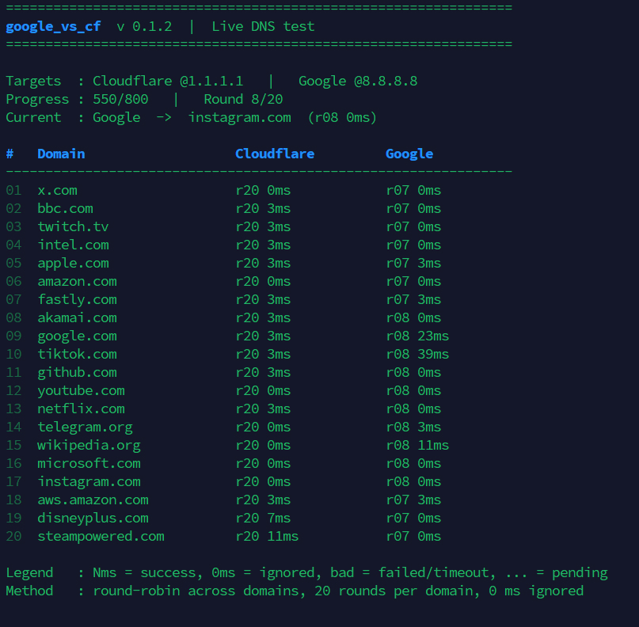

# google_vs_cf

A small Bash tool to:

- compare Cloudflare DNS and Google DNS
- show live in-place test progress in the terminal
- apply a locked `/etc/resolv.conf`
- reinstall `systemd-resolved` with a selected DNS profile
- inspect current resolver status

## Install

### curl

```bash
curl -fsSL -o google_vs_cf.sh https://raw.githubusercontent.com/WhiteMitty/google_vs_cf/main/google_vs_cf.sh && bash google_vs_cf.sh
```

### wget

```bash
wget -qO google_vs_cf.sh https://raw.githubusercontent.com/WhiteMitty/google_vs_cf/main/google_vs_cf.sh && bash google_vs_cf.sh
```

## Menu

- `1` Test DNS
- `2` Force apply + lock
- `3` Reinstall resolved
- `4` Unlock only
- `5` Show status
- `0` Exit

## Notes

- Run as `root`
- Designed for Debian/Ubuntu style systems
- `0 ms` results are ignored in stats and recommendation

<h2 align="left">DNS Test</h2>
<p align="left">
  
</p>

<h2 align="left">DNS Report</h2>
<p align="left">
  
</p>
